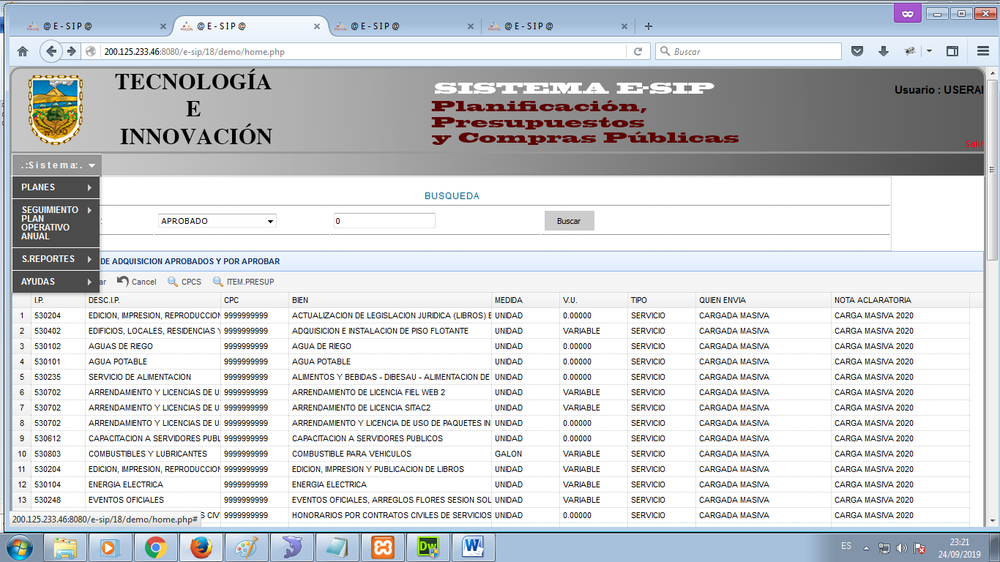
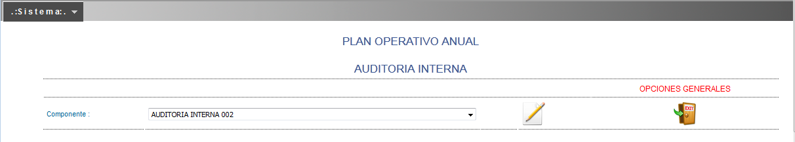
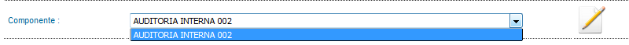
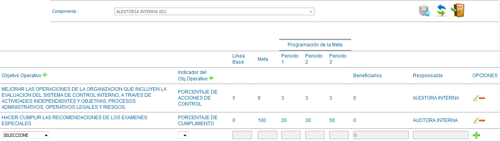

# Sistema ESIP POA/PAC

Sistema E-SIP

Manual de Usuario Operador POA / PAC

​

ACCESO

Proceda a ingresar las credenciales correspondientes para acceder al Sistema E-SIP (_imagen1)_.

<figure><figcaption></figcaption></figure>

(_imagen1. Login / Ingreso de Credenciales para el acceso al Sistema E-SIP_)

Si el ingreso de credenciales es correcto, esto re-direccionará a la página principal del Sistema E-SIP

MENÚ DE OPCIONES

Las opciones y operaciones del Sistema E-SIP se encuentran en la parte superior izquierda (_imagen3_).

<figure><figcaption></figcaption></figure>

(_imagen3. Menú del Sistema E-SIP_)

**PLANES / PLAN OPERATIVO ANUAL**

Para ingresar a esta opción nos dirigimos a la opción “PLANES”, sub opción “PLAN OPERATIVO ANUAL”, y se mostrará la siguiente pantalla (_imagen4_):

​

<figure><figcaption></figcaption></figure>

_(imagen4. Pantalla principal de “PLAN OPERATIVO ANUAL”)_

Luego de esta pantalla debemos escoger el componente al cual deseamos acceder (imagen5).

​

<figure><figcaption></figcaption></figure>

_(imagen5. Selección del componente a Editar)_

Paso siguiente, clic en el icono “editar” para poder acceder al mismo

<figure><figcaption></figcaption></figure>

En esta pantalla se encuentran enlistados los Objetivos Operativos con sus respectivos indicadores, periodos de medición de dichos objetivos y responsables de su ejecución.

​

<figure><figcaption></figcaption></figure>

(_imagen6. Acceso al componente seleccionado_)

Nuevo Objetivo Operativo.

Para crear nuevos Objetivos Operativos debemos dar clic en el icono “más”

Al dar clic en el ícono “más” se desplegará la siguiente ventana modal (image8)

(_imagen8. Formulario de ingreso de Nuevo Objetivo Operativo_)

Nuevo Indicador de Objetivo Operativo.

Para crear nuevos Indicadores de Objetivos Operativos debemos dar clic en el icono “más”

que se encuentra junto al título (_imagen9_).

(_imagen9. Ícono “más” para ingreso de Nuevos Indicadores de Objetivos Operativos_)

Al dar clic en el ícono “más” se desplegará la siguiente ventana modal (_image10_)

(_imagen10. Formulario de ingreso de Nuevo Indicador de Objetivo Operativo_)

Editar Planificación Registrada.

Para crear editar Objetivos Operativos debemos escoger un registro o fila y dar clic en el icono “editar”

que se encuentra al final de cada registro (_imagen11_).

(_imagen11. Registro o fila de Objetivo Operativo_)

Al dar clic en el ícono “editar” se desplegará un mensaje de confirmación (_imagen12_) que con el cuál usted aceptará modificar el registro seleccionado y aparecerá el mismo en modo edición al final de la tabla (_imagen13_)

(_imagen12. Mensaje de confirmación para modificar registro seleccionado_)

(_imagen13. Modo edición de registro seleccionado_)

Opciones Generales del Plan Operativo Anual

En la parte superior junto al nombre del componente se encuentran 3 íconos (_imagen14_) que realizan otras funciones:

​

(_imagen14. Íconos que se encuentran junto al componente_)

Al dar clic en el ícono “grabar”

se procederá a enviar datos del área seleccionada hacia el área de Planificación mediante la aceptación de un mensaje en forma de cuadro de diálogo (_imagen15_) y siguiente a esto nos aparecerá un mensaje de autorización (_imagen16_) para realizar la acción.

(_imagen15. Cuadro de diálogo para donde aceptamos el envío de información_)

(_imagen16. Cuadro de autorización para envío de información_)

Al dar clic en el ícono “cambiar”

nos permitirá cambiar o escoger otro componente para su edición.

Al dar clic en el ícono “exit” nos permitirá salir del módulo hacia la pantalla principal del sistema.

PLANES / PLAN ANUAL DE COMPRAS

Para ingresar a esta opción nos dirigimos a la opción “PLANES”, sub opción “PLAN ANUAL DE COMPRAS”, y se mostrará la siguiente pantalla (_imagen20_):

(_imagen20. Pantalla principal de “PLAN ANUAL DE COMPRAS”_)

Luego de esta pantalla debemos escoger el componente al cual deseamos acceder (_imagen21_).

(_imagen21. Selección de Componente a Editar_)

Paso siguiente, clic en el icono “editar” para poder acceder al mismo (_imagen22_).

(_imagen22. Listado de Objetivos Operativos con Bienes Vinculados_)

En esta pantalla se encuentran enlistados los Objetivos Operativos con sus respectivos indicadores, periodos de medición de dichos, y los respectivos bienes vinculados a dichos Objetivos Operativos.

Nuevo Registro de gasto.

Para crear un nuevo Item en la Tabla debemos dirigirnos al final de la misma e ingresar los valores que necesitamos en una fila en modo edición y luego dar clic en el icono “más” para agregar la fila. (_imagen23_).

(_imagen23. Agregar Nuevo Gasto en Plan Anual de Compras_)

Nuevo Bien / Servicio /Obra.

Para crear nuevos Bienes debemos dar clic en el icono “más” que se encuentra junto al título (_imagen24_).

(_imagen24. Ícono “más” para ingreso de Nuevo Bien / Servicio_)

Al dar clic en el ícono “más” se desplegará la siguiente ventana modal (_imagen25_) en la cual se debe seleccionar el ítem presupuestario, tipo de bien, medida, ingresar nombre y su costo respectivo.

(_imagen25. Formulario para el ingreso de nuevo Bien o Servicio_)

Ayuda Plan Anual de Compras.

Para obtener ayuda respecto a Bienes y servicios registrados en el Sistema E-SIP debemos dar clic en el icono “ayuda” que se encuentra junto al título y al ícono “más” (_imagen26_).

(_imagen26. Ícono “ayuda” para obtener ayuda respecto a Bienes registrados en el Sistema E-SIP_)

Al dar clic en el ícono “ayuda” se mostrará la pantalla con todos los Bienes registrados en el Sistema E‑SIP (_imagen27_), con respectivos filtros de búsqueda, etc.

(_imagen27. Pantalla donde se muestran los Bienes registrados en el Sistema E-SIP_)

Opciones Generales del Componente Plan Anual de Compras

En la parte superior junto al nombre del componente se encuentran 5 íconos (_imagen28_) que realizan otras funciones:

(_imagen28. Íconos que se encuentran junto al componente_)

Al dar clic en el ícono “grabar” se procederá a enviar datos del área seleccionada hacia el área Financiera mediante la aceptación de un mensaje en forma de cuadro de diálogo (_imagen29_) y siguiente a esto nos aparecerá un mensaje de autorización (imagen30) para realizar la acción.

(_imagen29. Cuadro de diálogo para donde aceptamos el envío de información_)

(_imagen30. Cuadro de autorización para envío de información_)

Al dar clic en el ícono “cambiar” nos permitirá cambiar o escoger otro componente para su edición.

Al dar clic en el ícono “exit” nos permitirá salir del módulo hacia la pantalla principal del sistema.

Al dar clic en el ícono “imprimir” nos permitirá imprimir la información del presente módulo (_imagen31_).

(_imagen31. Cuadro de dialogo para impresión de información seleccionada_)

Al dar clic en el ícono “siguiente” nos permitirá visualizar los saldos pre asignados en el presente componente (_imagen32_).

(_imagen32. Saldos preasignanos del presente Componente_)

Reporte Plan Operativo Anual

Una vez finalizado estos procesos se debe proceder a genera los reportes del Plan Operativo Anual con costos por Dirección/ Subprograma.

Para lo cual se debe seguir la siguiente ruta:

S.REPORTES -> PLAN OPERATIVO ANUAL PLANIFACION

El mismo que se genera con todos los detalles _(imagen 33)_

(_imagen33.Reporte Plan Operativo Anual_)

Como se muestra en el ejemplo se puede ver la Alineación al Objetivo del PND y a el objetivo Estratégico Institucional con su respectivo desglose de la planificación relacionada con el gasto económico propuesto.

Reporte Plan Anual de Compras

Una vez finalizado estos procesos se debe proceder a genera el reporte del Plan Anual de Compras Presupuestario por Dirección/ Subprograma.

Para lo cual se debe seguir la siguiente ruta:

S.REPORTES -> PLAN ANUAL DE COMPRAS POR AREAS INTERNAS.

El mismo que se genera con todos los detalles _(imagen 34)_

(_imagen34.Reporte Plan Anual de Compras_)

Se puede observar que se tiene el reporte acumulado por ítem presupuestario por la dirección /subprograma para el registro de datos por el área de Presupuestos.

Reporte Plan Anual de Compras Detalle

Ademas se debe generar el reporte detallado del Plan Anual de Compras :

S.REPORTES -> PLAN ANUAL DE COMPRAS POR AREAS INTERNAS.

El mismo que se genera con todos los detalles _(imagen 35)_

(_imagen35.Reporte Plan Anual de Compras Detalle_)

&#x20;

