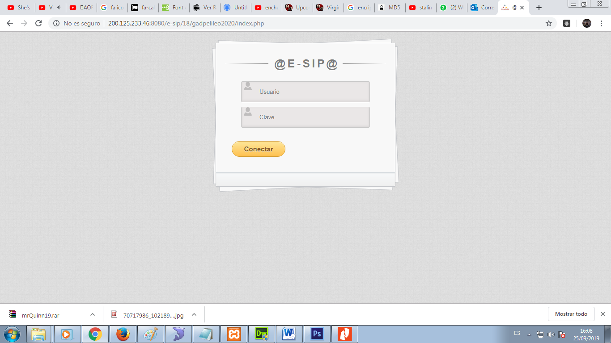
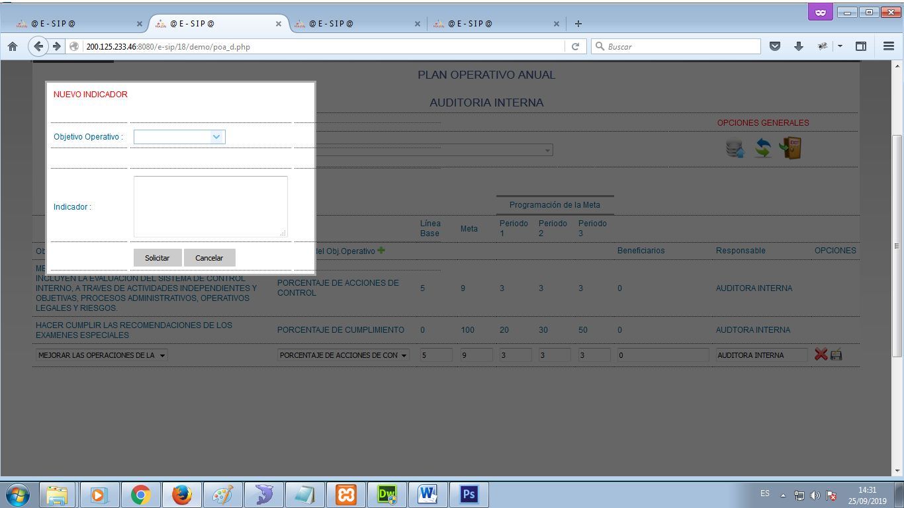
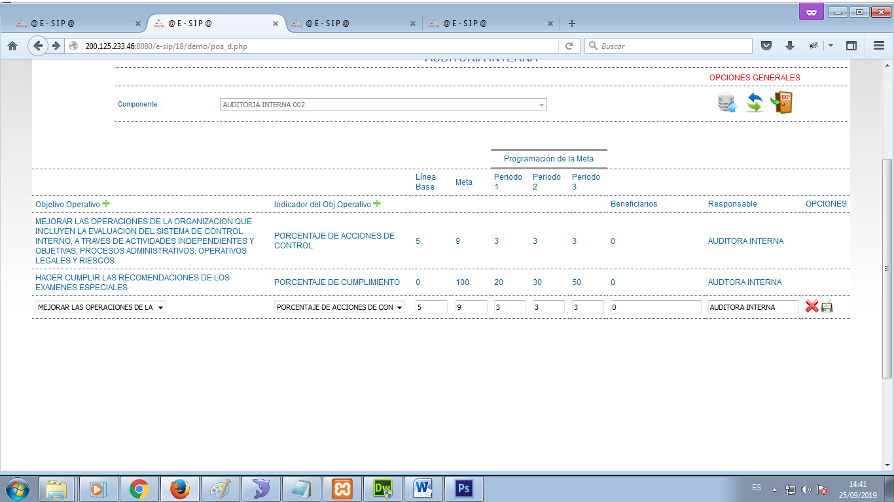
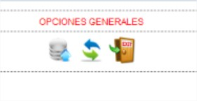
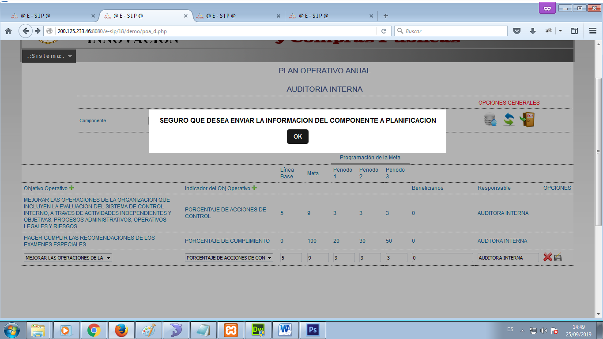
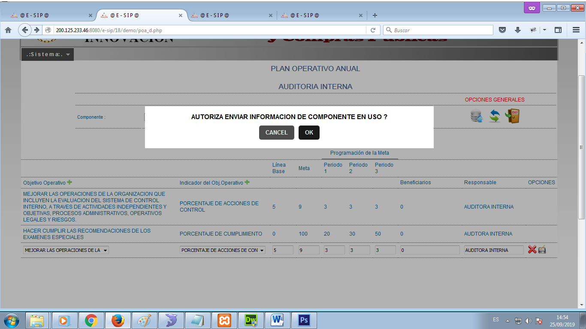

# Sistema ESIP POA/PAC

Sistema E-SIP

Manual de Usuario Operador POA / PAC

​

ACCESO

Proceda a ingresar las credenciales correspondientes para acceder al Sistema E-SIP (_imagen1)_.

<figure><figcaption></figcaption></figure>

(_imagen1. Login / Ingreso de Credenciales para el acceso al Sistema E-SIP_)

Si el ingreso de credenciales es correcto, esto re-direccionará a la página principal del Sistema E-SIP

MENÚ DE OPCIONES

Las opciones y operaciones del Sistema E-SIP se encuentran en la parte superior izquierda (_imagen3_).

<figure><figcaption></figcaption></figure>

(_imagen3. Menú del Sistema E-SIP_)

**PLANES / PLAN OPERATIVO ANUAL**

Para ingresar a esta opción nos dirigimos a la opción “PLANES”, sub opción “PLAN OPERATIVO ANUAL”, y se mostrará la siguiente pantalla (_imagen4_):

​

<figure><figcaption></figcaption></figure>

_(imagen4. Pantalla principal de “PLAN OPERATIVO ANUAL”)_

Luego de esta pantalla debemos escoger el componente al cual deseamos acceder (imagen5).

​

<figure><figcaption></figcaption></figure>

_(imagen5. Selección del componente a Editar)_

Paso siguiente, clic en el icono “editar”.png>) para poder acceder al mismo

<figure><figcaption></figcaption></figure>

En esta pantalla se encuentran enlistados los Objetivos Operativos con sus respectivos indicadores, periodos de medición de dichos objetivos y responsables de su ejecución.

​

<figure><figcaption></figcaption></figure>

(_imagen6. Acceso al componente seleccionado_)

Nuevo Objetivo Operativo.

Para crear nuevos Objetivos Operativos debemos dar clic en el icono “más”

Al dar clic en el ícono “más” se desplegará la siguiente ventana modal (image8)

<figure><figcaption></figcaption></figure>

(_imagen8. Formulario de ingreso de Nuevo Objetivo Operativo_)

Nuevo Indicador de Objetivo Operativo.

Para crear nuevos Indicadores de Objetivos Operativos debemos dar clic en el icono “más” que se encuentra junto al título (_imagen9_).

<figure><figcaption></figcaption></figure>

(_imagen10. Formulario de ingreso de Nuevo Indicador de Objetivo Operativo_)

Editar Planificación Registrada.

Para crear editar Objetivos Operativos debemos escoger un registro o fila y dar clic en el icono “editar”

Al dar clic en el ícono “editar” se desplegará un mensaje de confirmación (_imagen12_) que con el cuál usted aceptará modificar el registro seleccionado y aparecerá el mismo en modo edición al final de la tabla (_imagen13_)

<figure><figcaption></figcaption></figure>

(_imagen12. Mensaje de confirmación para modificar registro seleccionado_)

<figure><figcaption>
Edición de POA
</figcaption></figure>

​

**Opciones Generales del Plan Operativo Anual**

En la parte superior junto al nombre del componente se encuentran 3 íconos () que realizan otras funciones:(_imagen14. Íconos que se encuentran junto al componente_)

Al dar clic en el ícono “grabar”

se procederá a enviar datos del área seleccionada hacia el área de Planificación mediante la aceptación de un mensaje en forma de cuadro de diálogo y siguiente a esto nos aparecerá un mensaje de autorización (_imagen16_) para realizar la acción.

<figure><figcaption></figcaption></figure>

(_imagen15. Cuadro de diálogo para donde aceptamos el envío de información_)

<figure><figcaption></figcaption></figure>

(_imagen16. Cuadro de autorización para envío de información_)

Al dar clic en el ícono “cambiar”

nos permitirá cambiar o escoger otro componente para su edición.

Al dar clic en el ícono “exit”  nos permitirá salir del módulo hacia la pantalla principal del sistema.

**PLANES / PLAN ANUAL DE COMPRAS**

Para ingresar a esta opción nos dirigimos a la opción “PLANES”, sub opción “PLAN ANUAL DE COMPRAS”, y se mostrará la siguiente pantalla (_imagen20_):

<figure><figcaption></figcaption></figure>

Luego de esta pantalla debemos escoger el componente al cual deseamos acceder (_imagen21_).

<figure><figcaption></figcaption></figure>

Paso siguiente, clic en el icono “editar” .png>) para poder acceder al mismo (_imagen22_).

<figure><figcaption></figcaption></figure>

(_imagen22. Listado de Objetivos Operativos con Bienes Vinculados_)

En esta pantalla se encuentran enlistados los Objetivos Operativos con sus respectivos indicadores, periodos de medición de dichos, y los respectivos bienes vinculados a dichos Objetivos Operativos.

**Nuevo Registro de gasto.**

Para crear un nuevo Item en la Tabla debemos dirigirnos al final de la misma e ingresar los valores que necesitamos en una fila en modo edición y luego dar clic en el icono “más” para agregar la fila. (_imagen23_).

<figure><figcaption></figcaption></figure>

**Nuevo Bien / Servicio /Obra.**

Para crear nuevos Bienes debemos dar clic en el icono “más” que se encuentra junto al título (_imagen24_).

<figure><figcaption></figcaption></figure>

Al dar clic en el ícono “más” se desplegará la siguiente ventana modal (_imagen25_) en la cual se debe seleccionar el ítem presupuestario, tipo de bien, medida, ingresar nombre y su costo respectivo.

<figure><figcaption></figcaption></figure>

(_imagen25. Formulario para el ingreso de nuevo Bien o Servicio_)

Ayuda Plan Anual de Compras.

Para obtener ayuda respecto a Bienes y servicios registrados en el Sistema E-SIP debemos dar clic en el icono “ayuda” .png>) que se encuentra junto al título y al ícono “más” (_imagen26_).

<figure><figcaption></figcaption></figure>

Al dar clic en el ícono “ayuda” se mostrará la pantalla con todos los Bienes registrados en el Sistema E‑SIP (_imagen27_), con respectivos filtros de búsqueda, etc.

<figure><figcaption></figcaption></figure>

Opciones Generales del Componente Plan Anual de Compras

En la parte superior junto al nombre del componente se encuentran 5 íconos (_imagen28_) que realizan otras funciones:

<figure><figcaption></figcaption></figure>

Al dar clic en el ícono “grabar” se procederá a enviar datos del área seleccionada hacia el área Financiera mediante la aceptación de un mensaje en forma de cuadro de diálogo (_imagen29_) y siguiente a esto nos aparecerá un mensaje de autorización (imagen30) para realizar la acción.

<figure><figcaption></figcaption></figure>

Al dar clic en el ícono “cambiar” .png>) nos permitirá cambiar o escoger otro componente para su edición.

Al dar clic en el ícono “exit” .png>) nos permitirá salir del módulo hacia la pantalla principal del sistema.

Al dar clic en el ícono “imprimir” .png>) nos permitirá imprimir la información del presente módulo (_imagen31_).

<figure><figcaption></figcaption></figure>

Al dar clic en el ícono “siguiente” .png>) nos permitirá visualizar los saldos pre asignados en el presente componente (_imagen32_).

<figure><figcaption></figcaption></figure>

**Reporte Plan Operativo Anual**

Una vez finalizado estos procesos se debe proceder a genera los reportes del Plan Operativo Anual con costos por Dirección/ Subprograma.

Para lo cual se debe seguir la siguiente ruta:

S.REPORTES -> PLAN OPERATIVO ANUAL PLANIFACION

El mismo que se genera con todos los detalles _(imagen 33)_

<figure><figcaption></figcaption></figure>

Como se muestra en el ejemplo se puede ver la Alineación al Objetivo del PND y a el objetivo Estratégico Institucional con su respectivo desglose de la planificación relacionada con el gasto económico propuesto.

**Reporte Plan Anual de Compras**

Una vez finalizado estos procesos se debe proceder a genera el reporte del Plan Anual de Compras Presupuestario por Dirección/ Subprograma.

Para lo cual se debe seguir la siguiente ruta:

S.REPORTES -> PLAN ANUAL DE COMPRAS POR AREAS INTERNAS.

El mismo que se genera con todos los detalles _(imagen 34)_

<figure><figcaption></figcaption></figure>

Se puede observar que se tiene el reporte acumulado por ítem presupuestario por la dirección /subprograma para el registro de datos por el área de Presupuestos.

Reporte Plan Anual de Compras Detalle

Ademas se debe generar el reporte detallado del Plan Anual de Compras :

S.REPORTES -> PLAN ANUAL DE COMPRAS POR AREAS INTERNAS.

El mismo que se genera con todos los detalles _(imagen 35)_

<figure><figcaption></figcaption></figure>
