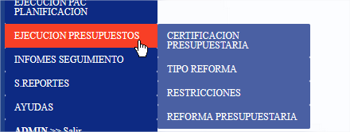

# Ejecución Presupuesto Certificación PAC

CREACION DE CERTIFICACIONES PAC

1.- Ingresar al sistema con el usuario de planificación

2.- Acceder a la ruta de CERTIFICACION PAC

<figure><figcaption></figcaption></figure>

3.- Crear la cabecera de la certificación :

<figure><figcaption></figcaption></figure>

4.- Dar clic en nuevo y se debe registrar los campos solicitados , dar clic en grabar para terminar de crear la cabecera:&#x20;

<figure><figcaption></figcaption></figure>

5.- Una vez creada la cabezera se reflejara en la parte inferior con los datos creados

<figure><figcaption></figcaption></figure>

6.- Para crear el detalle , se debe seleccionar la cabecera creada dar clic en

<figure><figcaption></figcaption></figure>

7.- Se refleja los siguientes campos&#x20;

<figure><figcaption></figcaption></figure>

8.- Vamos a detallar los campos a seleccionar :

8.1.- Detalle componente se refiere al componente / Direccion o área , allí se debe seleccionar de la que se va a generar la certificación pac:

<figure><figcaption></figcaption></figure>

8.2 En el lado derecho se carga en el Campo ITEM DEL PAC, todo lo que tiene en el sistema cargado (para este ejemplo del COMPRAS PUBLICAS) y seleccionamos que se va a certificar

<figure><figcaption></figcaption></figure>

8.3 Se refleja de esta manera los campos:

<figure><figcaption></figcaption></figure>

8.4 Para agregar se debe dar clic en el botón AGREGAR

<figure><figcaption></figcaption></figure>

8.5 Se refleja la información de esta manera en el detalle , se debe repetir estos paso de 8.1 a 8.4 para agregar mas detalles , una vez terminado de agregar dar clic en en el botón CERRAR DETALLES para cerrar esta opción.

9.- Se refleja la  información como el  ejemplo de la certificación 8 de descripción TEST 4

10.- Para finalizar la certificación se debe dar clic en el botón APROBAR(se debe seleccionar el registro como en la imagen para hacer este proceso) para cambiar el estado y que ya no se modifique.

11.- Se genera el reporte en estado aprobado.

