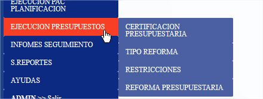

# Ejecución Presupuesto Certificación

<figure><figcaption>
Menu Sistema
</figcaption></figure>

Ingresado en la opción se refleja&#x20;

<figure><figcaption>
Certificación Presupuestaria
</figcaption></figure>

Se debe registrar los campos:

* Número de Certificación: Número de certificación que se emite o de otro sistema (esigef, interno)
* Esigef: Seleccionar SI O NO&#x20;
* Descripción: detalle de la certificación a emitir&#x20;
* Número de respaldo: Documento de Respaldo
* Fecha Elaboración: Fecha en la que se genera

Dar clic en Grabar y se refleja la información de esta maneraAllí tenemos las opciones :&#x20;

<figure><figcaption>
Opción NUEVO
</figcaption></figure>

Editar: Se puede realizar modificaciones mientras este en estado registrado

Eliminar: Se puede realizar esta operación mientras este en estado registrado

Para poder agregar un detalle dar clic en  .png>)

Allí se refleja el siguiente formulario

<figure><figcaption>
DetalleCertificación Presupuestaria
</figcaption></figure>

En la cual se debe seleccionar COMPONENTE (Nombre Dirección/ Unidad/Área Interna)

<figure><figcaption>
Listado de Unidades
</figcaption></figure>

Se procede a seleccionar y se refleja  en el campo CERTIFICACIONES PAC REGISTRADAS

<figure><figcaption>
Selección de Datos Pac
</figcaption></figure>

Se debe seleccionar según las  certificaciones PAC emitidas&#x20;

<figure><figcaption>
Selección de Datos detale
</figcaption></figure>

Se refleja los datos como se ve en el imagen anterior

Para terminar de agregar la certificación pac dar clic en AGREGAR

Dar clic en CERRAR DETALLES

<figure><figcaption>
Botón Cerrar Detalles
</figcaption></figure>

Luego de ello se debe  generar el reporte  .png>)

<figure><figcaption></figcaption></figure>

Para finalizar el proceso se debe dar clic en aprobar

&#x20;

<figure><figcaption></figcaption></figure>

